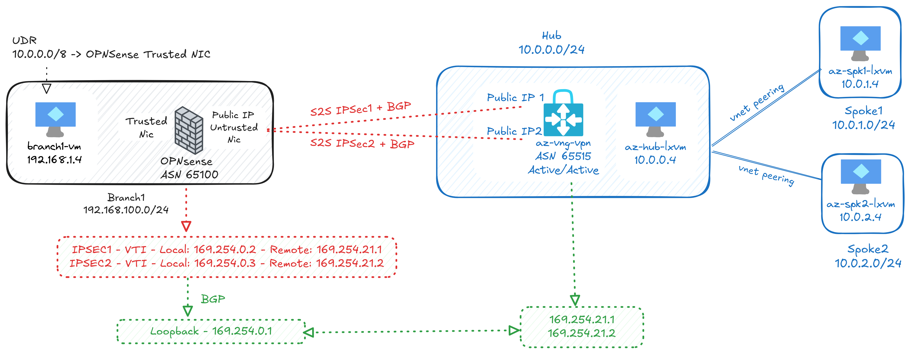

# Lab: Active/Active Azure VPN Gateway S2S VPN with BGP and OPNSense

This lab demonstrates how to set up a hub-and-spoke network topology using Azure Virtual Network Gateway (VNG) VPN and OPNSense firewall as a branch device.

This lab uses Active/Active VPN Gateway using two IPsec tunnels to connect the Azure hub network with a branch network that uses OPNSense as a firewall appliance. In this lab we use VTI and a loopback interface on the OPNSense to instance the BGP. 

## Network Topology

The lab consists of three main scripts to deploy the hub and spoke and also the branch network with OPNSense:

1. **`1hub-deploy.sh`**: Deploys Azure resources for the hub network, including VNet, subnets, and Virtual Network Gateway (VNG). There are a Linux VM on each vNet (Hub, Spoke1, and Spoke2).

2. **`2branch-deploy.sh`**: Deploys Azure resources for the branch network, including the VNet, subnets, and an OPNSense firewall appliance.

3. **`3configurevpn.sh`**: Configures the VPN connection between the Azure VNG in the hub and the OPNSense firewall in the branch.

## OPNSense configuration

### Reviewing `config-OPNSense.xml`

The `config-OPNSense.xml` file contains the exported configuration for the OPNSense firewall used in this lab. Key changes and settings include:

- **Interfaces:** Configuration of WAN and LAN interfaces, as well as additional interfaces for VTI (Virtual Tunnel Interface) to support IPsec VPN tunnels.
- **IPsec:** Definition of two IPsec phase 1 and phase 2 entries, each corresponding to a tunnel to the Azure VPN Gateway. These entries specify the peer IP addresses, authentication methods, encryption algorithms, and use of VTI mode.
- **BGP (FRR):** BGP routing is enabled using the FRR plugin. The configuration includes the local ASN, BGP neighbor definitions (pointing to Azure BGP peers), and network advertisements for the branch subnet.
- **Firewall Rules:** Rules are added to allow IPsec and BGP traffic on the relevant interfaces, ensuring connectivity between Azure and the branch.
- **Loopback Interface:** A loopback interface is configured and used as the BGP router ID, which is a best practice for stable BGP sessions.

You can review or import this file in the OPNSense web UI under System > Configuration > Backup & Restore to apply the lab settings.