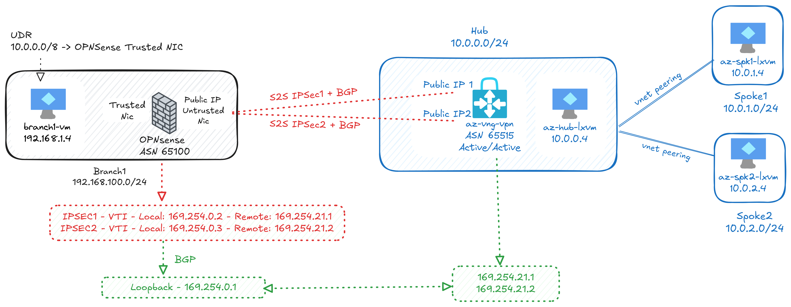

# Lab: Active/Active Azure VPN Gateway S2S VPN with BGP and OPNsense


This lab demonstrates how to set up a hub-and-spoke network topology using Azure Virtual Network Gateway (VNG) VPN and OPNsense firewall as a branch device.

This lab uses Active/Active VPN Gateway using two IPsec tunnels to connect the Azure hub network with a branch network that uses OPNsense as a firewall appliance. In this lab we use VTI and a loopback interface on OPNsense to establish BGP sessions.

## Prerequisites

Before running any scripts, ensure the following are in place:

### 1. Azure CLI

Install the [Azure CLI](https://learn.microsoft.com/cli/azure/install-azure-cli) and verify it is available:

```bash
az --version
```

### 2. Sign in to Azure

```bash
az login
```

### 3. Select the correct subscription

List available subscriptions and set the one you want to deploy to:

```bash
# List subscriptions
az account list --output table

# Set the target subscription (use the Name or SubscriptionId from the list above)
az account set --subscription "<subscription-name-or-id>"

# Verify the active subscription
az account show --output table
```

### 4. Script execution permissions

Make the scripts executable before running them:

```bash
chmod +x 1hub-deploy.sh 2branch-deploy.sh 3configureazpn.sh
```

---

## Network Topology



The lab consists of three main scripts to deploy the hub and spoke and also the branch network with OPNSense:

1. **`1hub-deploy.sh`**: Deploys Azure resources for the hub network, including VNet, subnets, and Virtual Network Gateway (VNG). There is a Linux VM on each VNet (Hub, Spoke1, and Spoke2).

2. **`2branch-deploy.sh`**: Deploys Azure resources for the branch network, including the VNet, subnets, and an OPNsense firewall appliance.

3. **`3configureazpn.sh`**: Configures the VPN connection between the Azure VNG in the hub and the OPNsense firewall in the branch.

---

## Estimated Cost

> **Note:** Prices below are approximate Pay-As-You-Go rates for the **West US 3** region (default). Actual costs vary by region and subscription type. Always verify with the [Azure Pricing Calculator](https://azure.microsoft.com/pricing/calculator/).

### Resources deployed

| Resource | SKU / Details | Qty | $/hr (each) | $/hr (total) |
|---|---|:---:|:---:|:---:|
| **Hub/Spoke Linux VMs** (`Standard_B2s`, 2 vCPU / 4 GB) | Hub-VM, Spoke1-VM, Spoke2-VM | 3 | $0.046 | $0.138 |
| **OPNsense NVA VM** (`Standard_B2s`, 2 vCPU / 4 GB) | FreeBSD — no software fee | 1 | $0.046 | $0.046 |
| **Branch Ubuntu VM** (`Standard_B1ms`, 1 vCPU / 2 GB) | | 1 | $0.021 | $0.021 |
| **VPN Gateway** (Active/Active `VpnGw1`) | Dominant cost — cannot be stopped | 1 | $0.190 | $0.190 |
| **Azure Bastion** (Basic tier) | | 1 | $0.190 | $0.190 |
| **S2S VPN Connection** | Azure ↔ OPNsense (2 IPsec tunnels) | 1 | $0.050 | $0.050 |
| **Standard Public IPs** | 2× VPN GW + 1× OPNsense | 3 | $0.005 | $0.015 |
| **VNets, NSGs, Route Tables, NICs** | Free | — | — | — |

### Cost summary

| Scenario | Estimated cost |
|---|---|
| **Per hour** (all resources running) | ~**$0.65** |
| **8-hour lab session** | ~**$5.20** |
| **Per day** (24 h) | ~**$15.60** |
| **Per month** (left running 24/7) | ~**$470** |

### Cost-saving tips

- **Delete the resource group when done** — `az group delete --name lab-vng-opn --yes --no-wait` — the VPN Gateway and Bastion run 24/7 even while idle and account for ~58% of the total cost.
- **Deallocate VMs** when not actively testing — stopped (deallocated) VMs do not incur compute charges.
- The VPN Gateway **cannot be stopped/deallocated**; delete and redeploy it if you need to pause the lab for an extended period.

---

## OPNsense configuration

### Reviewing `config-OPNSense.xml`

The `config-OPNSense.xml` file contains the exported configuration for the OPNSense firewall used in this lab. Key changes and settings include:

- **Interfaces:** Configuration of WAN and LAN interfaces, as well as additional interfaces for VTI (Virtual Tunnel Interface) to support IPsec VPN tunnels.
- **IPsec:** Definition of two IPsec phase 1 and phase 2 entries, each corresponding to a tunnel to the Azure VPN Gateway. These entries specify the peer IP addresses, authentication methods, encryption algorithms, and use of VTI mode.
- **BGP (FRR):** BGP routing is enabled using the FRR plugin. The configuration includes the local ASN, BGP neighbor definitions (pointing to Azure BGP peers), and network advertisements for the branch subnet.
- **Firewall Rules:** Rules are added to allow IPsec and BGP traffic on the relevant interfaces, ensuring connectivity between Azure and the branch.
- **Loopback Interface:** A loopback interface is configured and used as the BGP router ID, which is a best practice for stable BGP sessions.

You can review or import this file in the OPNsense web UI under System > Configuration > Backup & Restore to apply the lab settings.