# LAB: WireGuard VPN with OPNsense in Azure

## Overview

This lab demonstrates how to deploy OPNsense as a Network Virtual Appliance (NVA) in Azure, configure it with WireGuard VPN, and set up client configurations for secure remote access.

### Network Diagram

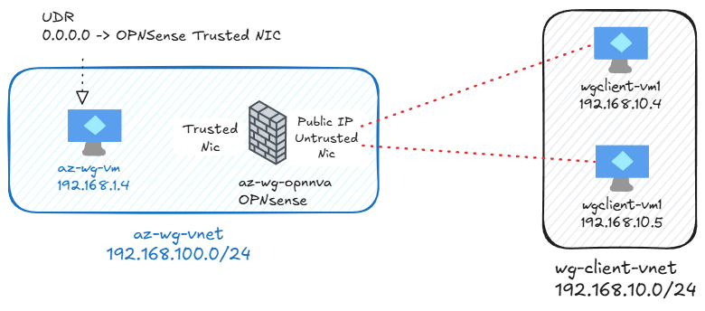

### OPNsense Deployment

OPNSense will be deployed by default on the Resource Group `lab-wg-nva`.

```bash
curl -sSL -o 1nva-deploy.sh https://raw.githubusercontent.com/dmauser/azure-opnsense-labs/main/wireguard/1nva-deploy.sh
chmod +x 1nva-deploy.sh
./1nva-deploy.sh
```

### WireGuard clients deployment

WireGuard client configuration will be deployed by default on the Resource Group `lab-wg-client`.

```bash
curl -sSL -o 2client-deploy.sh https://raw.githubusercontent.com/dmauser/azure-opnsense-labs/main/wireguard/2client-deploy.sh
chmod +x 2client-deploy.sh
./2client-deploy.sh
```

### OPNsense WireGuard Configuration

1. Configure Static Routes

- System:Routes:Configuration: add RFC 1918 routes ensure they use LAN_GW as next hop as shown:

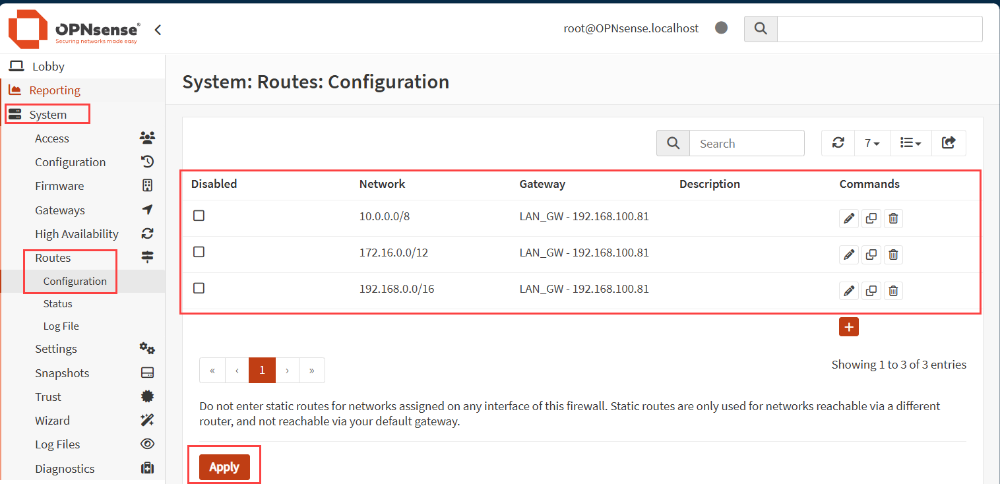

> ⚡ **Make sure to click "Apply" to commit the changes.**

2. Configure WireGuard

- VPN:WireGuard:Configuration: Ensure to populated Name, Listen Port, Tunnel address, and Generate a new keypair as shown:

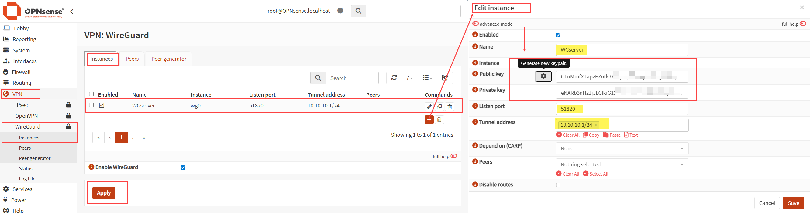

3. Assign and configure WireGuard Interface

- Interfaces:Assignments

    - Add WireGuard as description and click in add button.
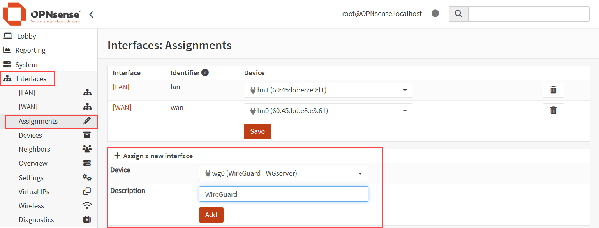

    - Click on save to commit the changes.
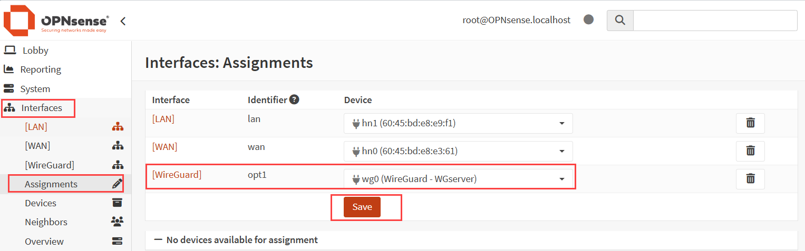

- Interfaces:WireGuard

    - Enable Interface and Prevent interface removal and click on save.
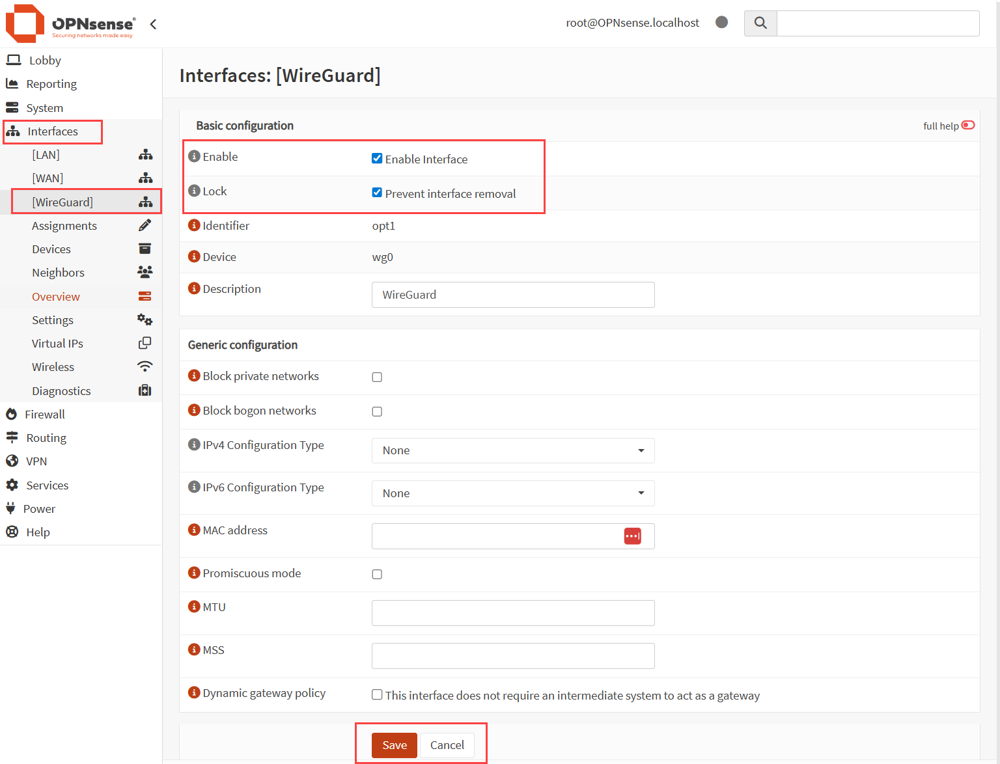

4. Make adjustments on the Firewall rules

- Firewall:Rules:WireGuard

    - Add a rule to allow all traffic to the WireGuard interface.
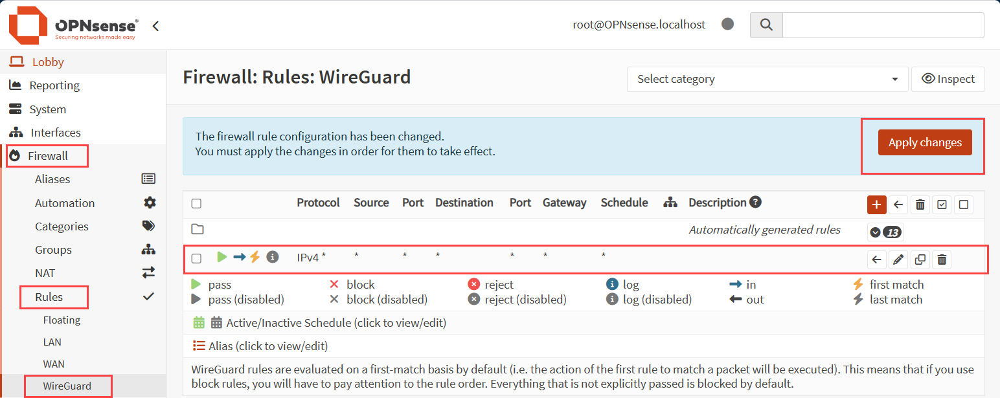

- Firewall:Rules:LAN

    - Edit LAN rule (Default allow LAN to any Rule) and change the source from LAN net to any. Review the rule and click in apply to commit the changes.
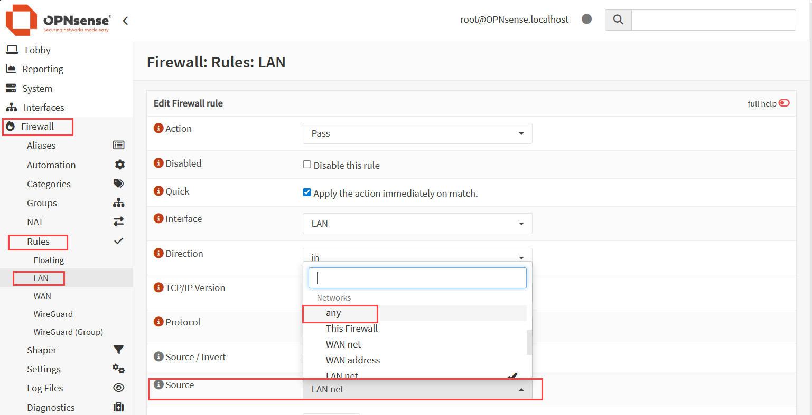
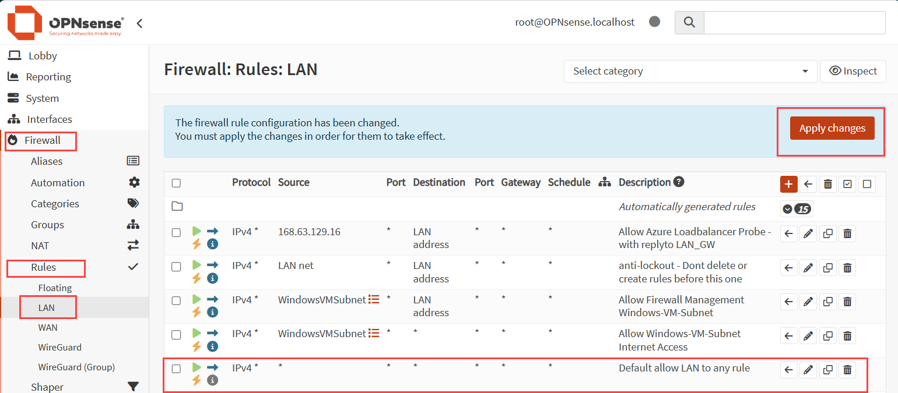

- Firewall:Rules:WAN

    - Add rule to allow UDP port 51820 which is the default WireGuard port.
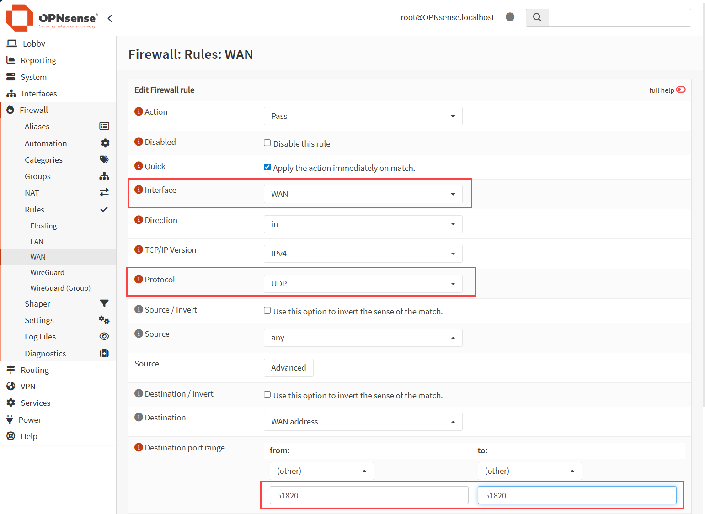
    - Review the rule and click in apply to commit the changes.
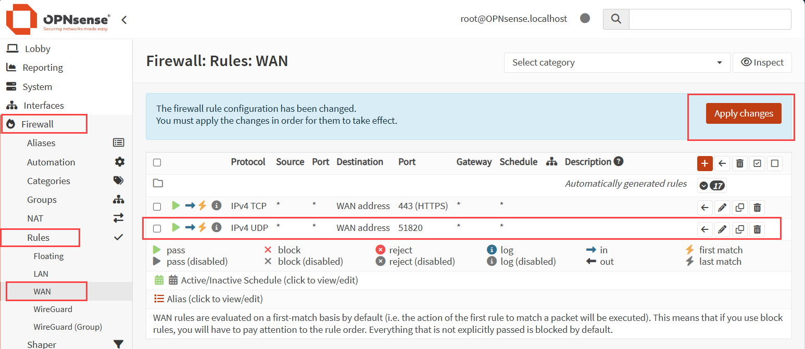

5. Generate WireGuard client configuration

- VPN:WireGuard:Peer Generator: Configure the Peer Generator with the following settings:
  - Endpoint: **"opnsense-public-ip:51820"**
  - Name: wgclient-vm1
  - DNS Server: 8.8.8.8

- **⚠️ Important** Make sure to copy the Config content (in yellow below) to Notepad before clicking in **Store and generated next** and **Apply** to commit the changes.
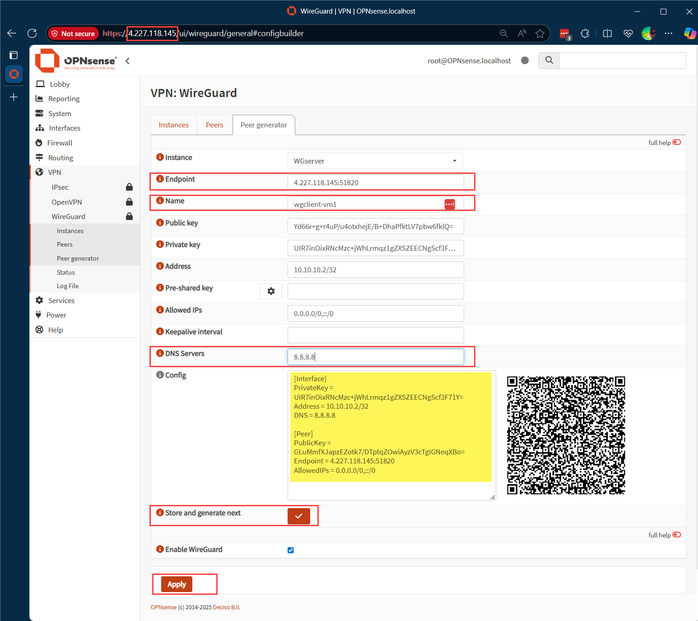


### Client configuration

1. Open WireGuard client using serial console.
2. Run the following commands to download and execute the WireGuard client configuration script:

```bash
curl -sSL -o wfconfig.sh https://raw.githubusercontent.com/dmauser/azure-opnsense-labs/main/wireguard/script/wfconfig.sh
chmod +x wfconfig.sh
./wfconfig.sh
```

Example:
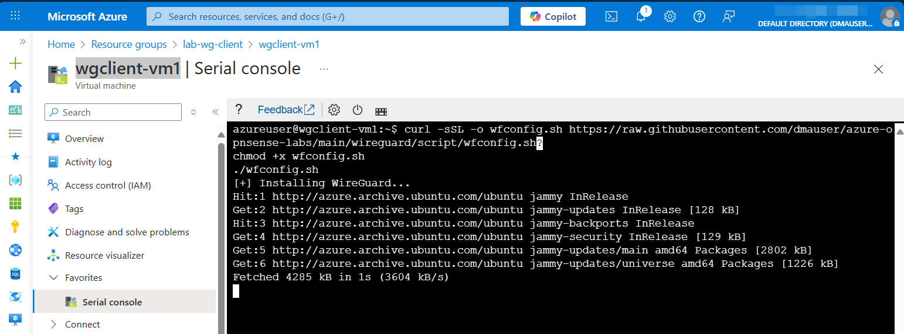

3. The script will prompt you to enter the WireGuard configuration. Paste the configuration you copied from the OPNsense Peer Generator that you copy to notepad and type EOF and press Enter, as shown below:

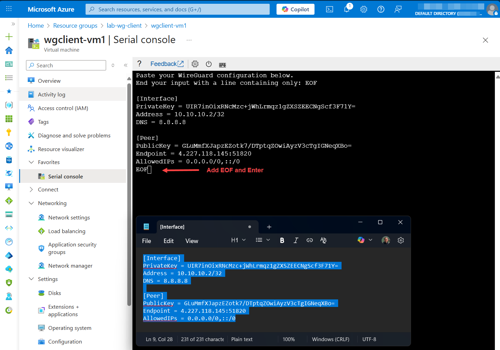

## WireGuard Client Connection validation

1. After the WireGuard client configuration is complete, you can check the status of the WireGuard interface by running:

```bash
ifconfig wg0 # it displays the WireGuard interface
ping 10.10.10.1 -c 5 # That is the OPNsense WireGuard interface IP
ping 192.169.100.4 -c 5 # That is the az-wg-vm1 client which on the OPNSense side.
sudo wg show # It displays the WireGuard interface and connection status
```

Here is an example of the output you should see:
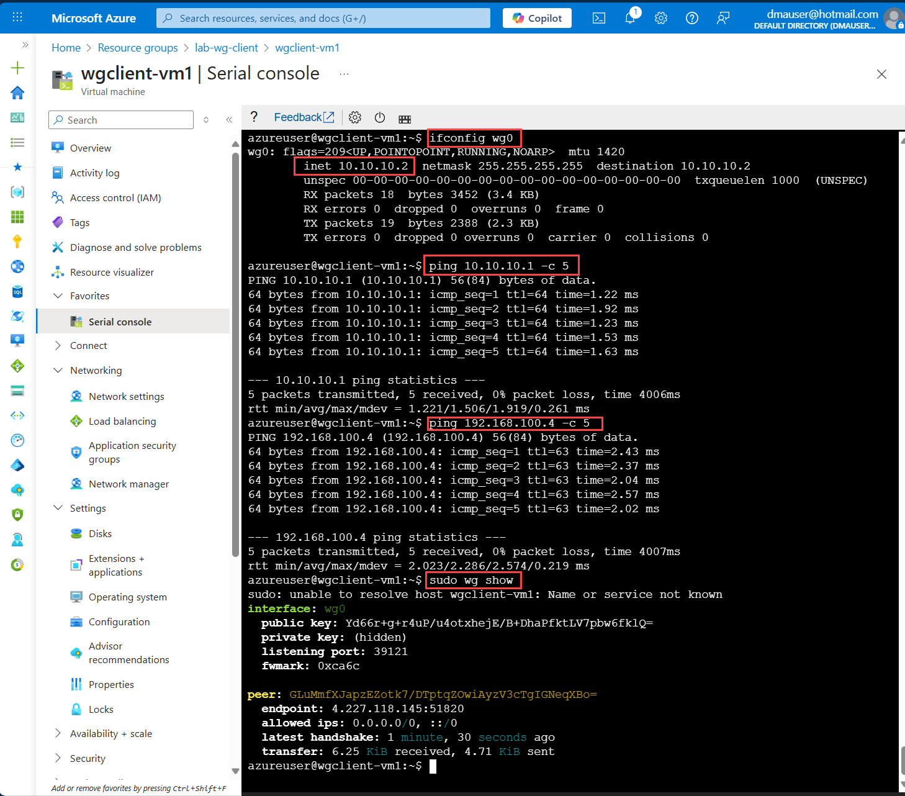

2. On the OPNsense side, you can check the WireGuard status by navigating to: **VPN:WireGuard:Status** as shown below:
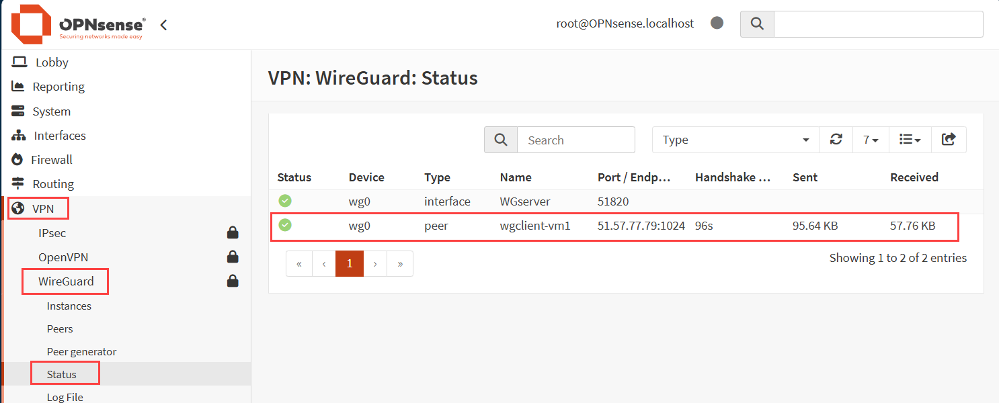

### Lab Cleanup

To clean up the resources created during this lab, run the following commands:

```bash
curl -sSL -o cleanup.sh https://raw.githubusercontent.com/dmauser/azure-opnsense-labs/main/wireguard/3cleanup.sh
chmod +x cleanup.sh
./cleanup.sh
```