# LAB: WireGuard VPN with OPNsense in Azure

## Table of Contents
- [Prerequisites](#prerequisites)
- [Overview](#overview)
- [Network Diagram](#network-diagram)
- [Network Topology](#network-topology)
- [OPNsense Deployment](#opnsense-deployment)
- [WireGuard Clients Deployment](#wireguard-clients-deployment)
- [OPNsense WireGuard Configuration](#opnsense-wireguard-configuration)
- [Client Configuration](#client-configuration)
- [WireGuard Client Connection Validation](#wireguard-client-connection-validation)
- [Troubleshooting](#troubleshooting)
- [Lab Cleanup](#lab-cleanup)

## Prerequisites

Before starting this lab, ensure you have the following:

### Required Tools
- **Azure CLI**: Install and configure Azure CLI ([Installation Guide](https://docs.microsoft.com/en-us/cli/azure/install-azure-cli))
- **Bash Shell**: Linux, macOS, or Windows Subsystem for Linux (WSL)
- **curl**: For downloading deployment scripts

### Azure Requirements
- **Active Azure Subscription** with sufficient credits/quota
- **Contributor permissions** on the subscription or resource group
- **Available quota** for:
  - Standard_DS1_v2 VMs (minimum 2 instances)
  - Virtual Networks
  - Public IP addresses
  - Network Security Groups

### Knowledge Prerequisites
- Basic understanding of Azure networking concepts
- Familiarity with VPN technologies
- Command line experience

> ⚠️ **Important**: This lab will create billable Azure resources. Make sure to run the cleanup script at the end to avoid unexpected charges.

## Overview

This lab demonstrates how to deploy OPNsense as a Network Virtual Appliance (NVA) in Azure, configure it with WireGuard VPN, and set up client configurations for secure remote access.

### Network Diagram

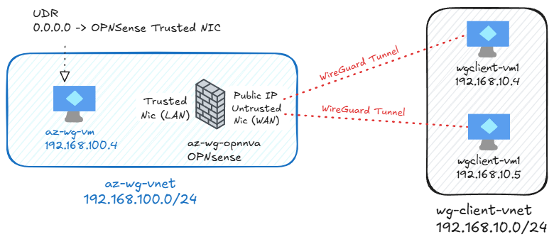

### Network Topology

This lab creates the following network architecture:

#### Resource Groups

- **`lab-wg-nva`**: Contains the OPNsense firewall and supporting infrastructure
- **`lab-wg-client`**: Contains the WireGuard client VMs for testing

#### Network Configuration

- **OPNsense Virtual Network**: `192.168.100.0/24`
  - **Untrusted Subnet** (WAN): `192.168.100.64/28` - Internet-facing interface
  - **Trusted Subnet** (LAN): `192.168.100.80/28` - Internal network interface
- **WireGuard Tunnel Network**: `10.10.10.0/24`
  - **OPNsense WireGuard Interface**: `10.10.10.1`
  - **Client IP Range**: `10.10.10.2` and onwards

#### Key Components

- **OPNsense NVA**: Network Virtual Appliance with dual NICs
- **WireGuard Port**: UDP 51820 (default)
- **WireGuard Clients**: Linux WireGuard clients

#### Traffic Flow

1. Remote clients connect to OPNsense public IP via WireGuard (UDP 51820)
2. WireGuard tunnel established between client and OPNsense
3. Client traffic routed through OPNsense to access Azure resources
4. Return traffic sent back through the encrypted tunnel

### OPNsense Deployment

This script deploys the OPNsense Network Virtual Appliance with the following components:

**What it creates:**
- Resource Group: `lab-wg-nva`
- Virtual Network with untrusted (WAN) and trusted (LAN) subnets
- OPNsense VM with dual network interfaces
- Public IP address for internet connectivity
- Network Security Groups with appropriate rules
- Test VM for validation

**Estimated time:** 15-20 minutes

The script will prompt you for:
- Azure region (default: westus3)
- Username and password for VM access

```bash
curl -sSL -o 1nva-deploy.sh https://raw.githubusercontent.com/dmauser/azure-opnsense-labs/main/wireguard/1nva-deploy.sh
chmod +x 1nva-deploy.sh
./1nva-deploy.sh
```

### WireGuard Clients Deployment

This script creates client VMs for testing the WireGuard VPN connection:

**What it creates:**
- Resource Group: `lab-wg-client`
- Virtual Network for client VMs
- Linux VM with WireGuard client pre-installed
- Network Security Groups for client access

**Estimated time:** 10-15 minutes

**Prerequisites:** 
- OPNsense deployment must be completed first
- Azure CLI must be authenticated

```bash
curl -sSL -o 2client-deploy.sh https://raw.githubusercontent.com/dmauser/azure-opnsense-labs/main/wireguard/2client-deploy.sh
chmod +x 2client-deploy.sh
./2client-deploy.sh
```

### OPNsense WireGuard Configuration

1. Configure Static Routes

- System:Routes:Configuration: add RFC 1918 routes and ensure they use LAN_GW as next hop as shown:

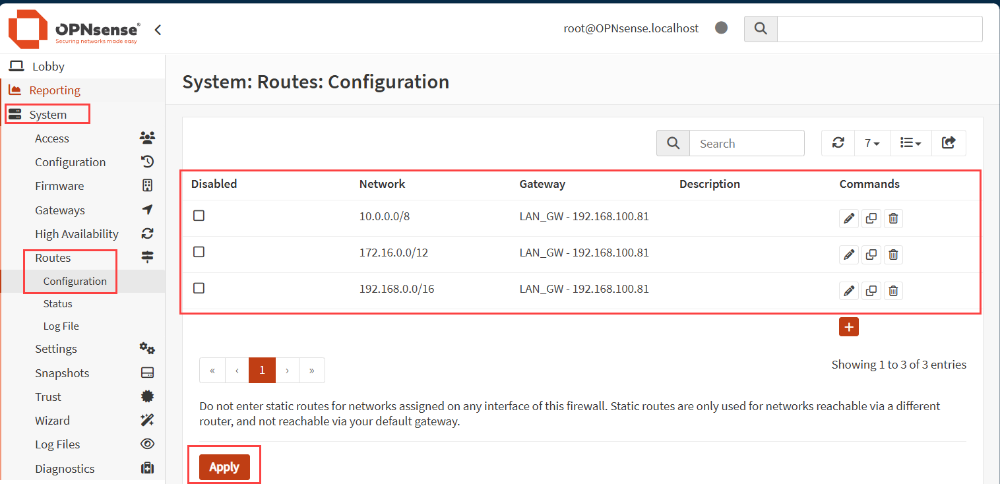

> ⚡ **Make sure to click "Apply" to commit the changes.**

2. Configure WireGuard

- VPN:WireGuard:Configuration: Ensure to populate Name, Listen Port, Tunnel address, and Generate a new keypair as shown:

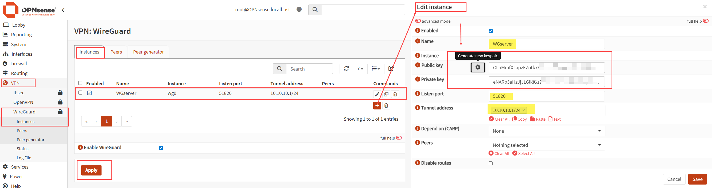

3. Assign and configure WireGuard Interface

- Interfaces:Assignments

    - Add WireGuard as description and click the add button.
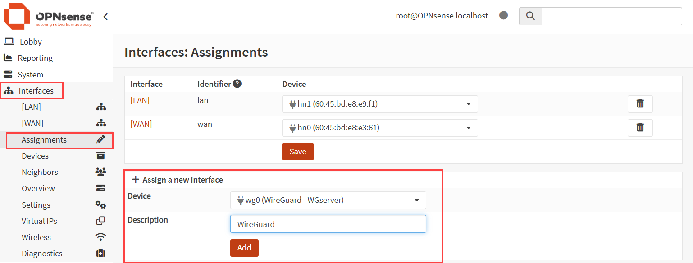

    - Click on save to commit the changes.
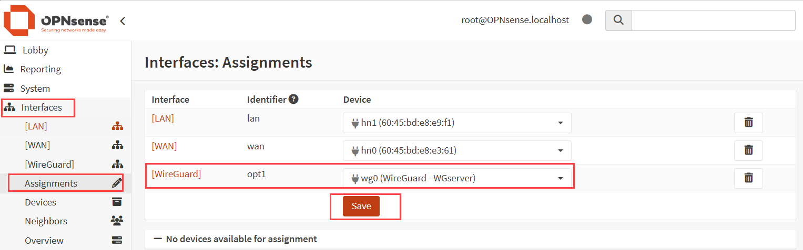

- Interfaces:WireGuard

    - Enable Interface and Prevent interface removal and click on save.
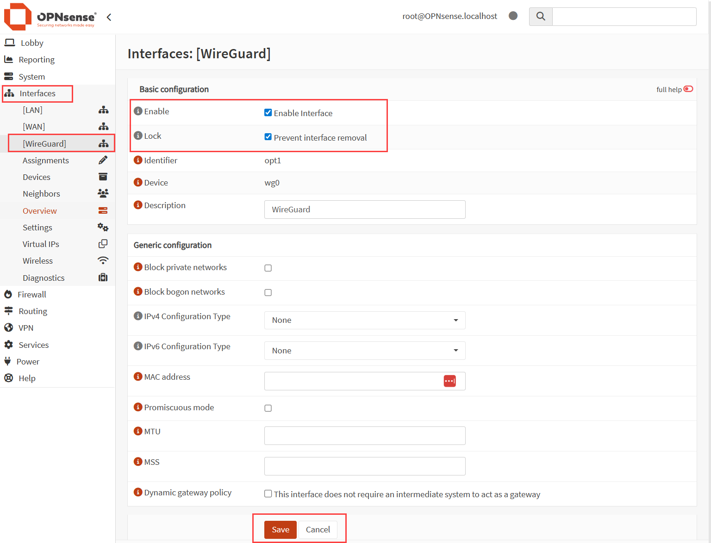

4. Make adjustments on the Firewall rules

- Firewall:Rules:WireGuard

    - Add a rule to allow all traffic to the WireGuard interface.
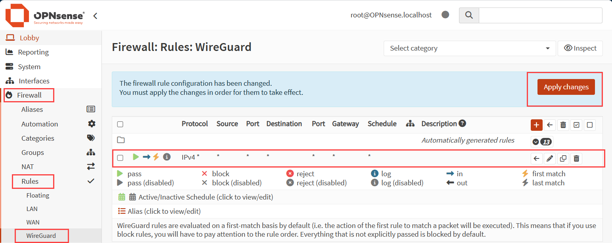

- Firewall:Rules:LAN

    - Edit LAN rule (Default allow LAN to any Rule) and change the source from LAN net to any. Review the rule and click apply to commit the changes.
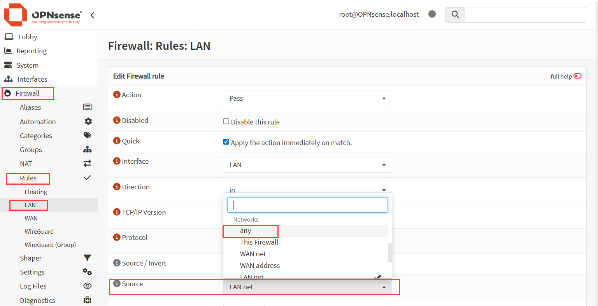
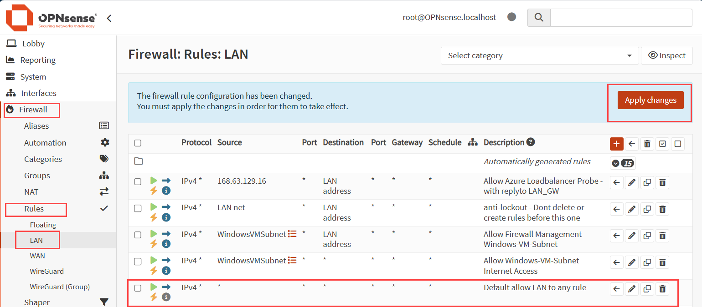

- Firewall:Rules:WAN

    - Add rule to allow UDP port 51820 which is the default WireGuard port.
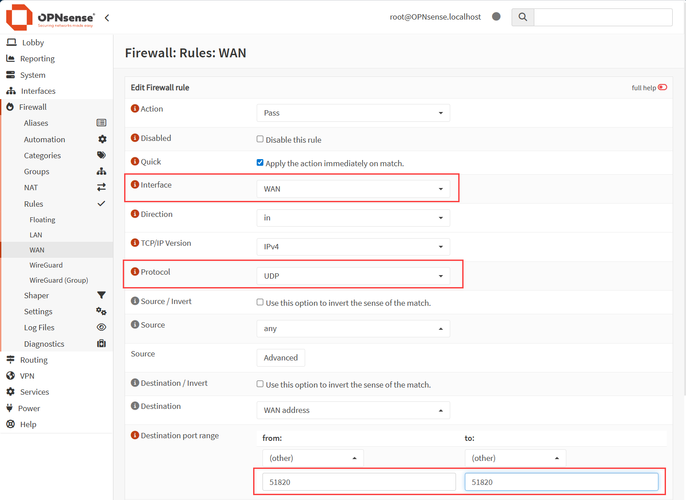
    - Review the rule and click apply to commit the changes.
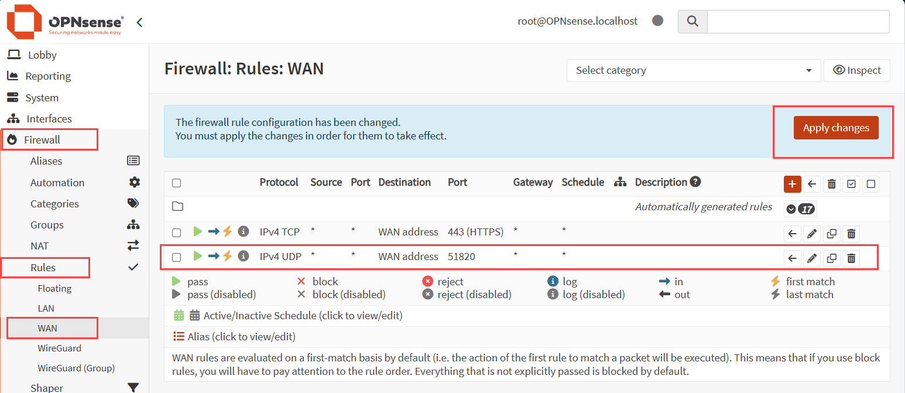

5. Generate WireGuard client configuration

- VPN:WireGuard:Peer Generator: Configure the Peer Generator with the following settings:
  - Endpoint: **"opnsense-public-ip:51820"**
  - Name: wgclient-vm1
  - DNS Server: 8.8.8.8

- **⚠️ Important** Make sure to copy the Config content (in yellow below) to Notepad before clicking in **Store and generated next** and **Apply** to commit the changes.
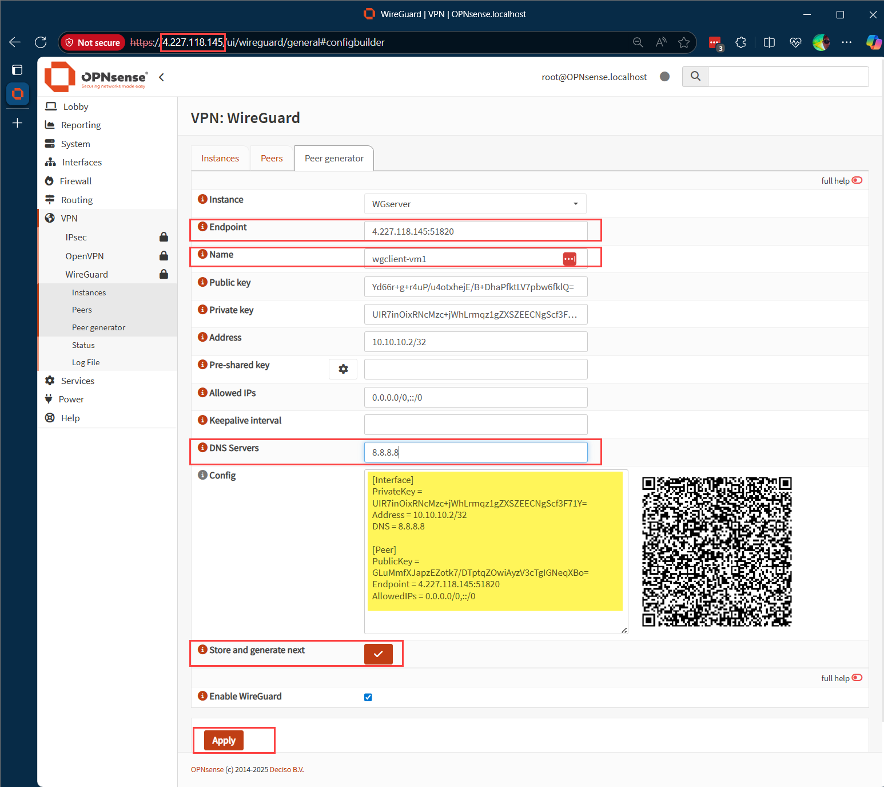

### Client Configuration

This section configures the WireGuard client with the settings generated from OPNsense.

**What this script does:**
- Downloads and installs WireGuard client tools
- Creates the WireGuard configuration file
- Enables the WireGuard interface
- Starts the VPN connection

**Prerequisites:**
- OPNsense WireGuard configuration must be completed
- Client configuration from Peer Generator must be copied

1. Open WireGuard client using serial console.
2. Run the following commands to download and execute the WireGuard client configuration script:

```bash
curl -sSL -o wfconfig.sh https://raw.githubusercontent.com/dmauser/azure-opnsense-labs/main/wireguard/script/wfconfig.sh
chmod +x wfconfig.sh
./wfconfig.sh
```

Example:
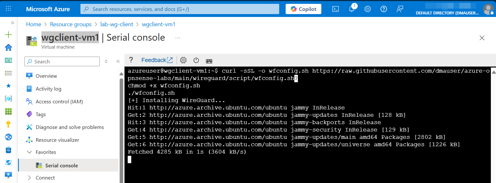

3. The script will prompt you to enter the WireGuard configuration. Paste the configuration you copied from the OPNsense Peer Generator that you copied to notepad and type EOF and press Enter, as shown below:

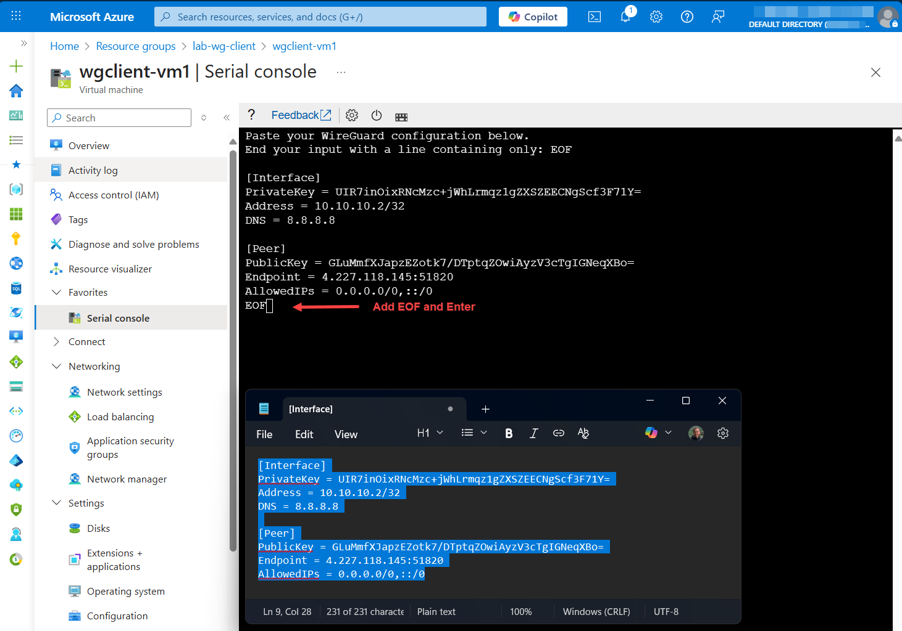

## WireGuard Client Connection validation

1. After the WireGuard client configuration is complete, you can check the status of the WireGuard interface by running:

```bash
ifconfig wg0 # it displays the WireGuard interface
ping 10.10.10.1 -c 5 # That is the OPNsense WireGuard interface IP
ping 192.169.100.4 -c 5 # That is the az-wg-vm1 client which on the OPNsense side.
sudo wg show # It displays the WireGuard interface and connection status
```

- Here is an example of the output you should see:
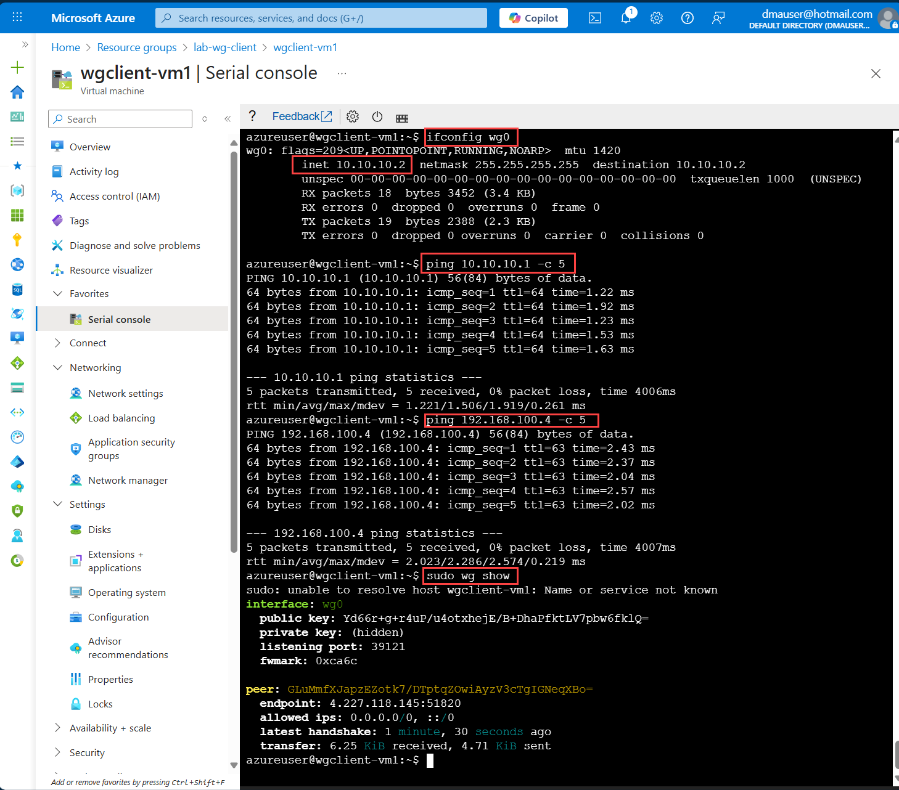

2. On the OPNsense side, you can check the WireGuard status by navigating to: **VPN:WireGuard:Status** as shown below:
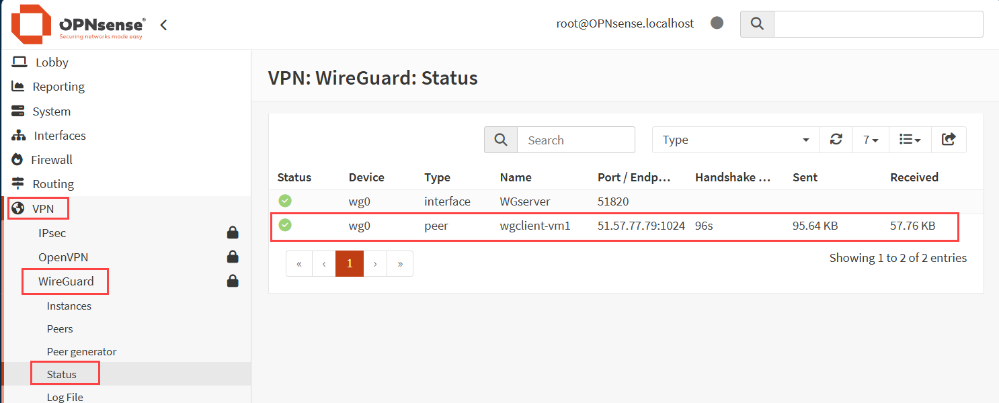

## Troubleshooting

This section covers common issues and their solutions.

### Deployment Issues

#### Script Permission Errors
**Problem:** `Permission denied` when running deployment scripts
**Solution:**
```bash
chmod +x script-name.sh
./script-name.sh
```

#### Azure CLI Not Authenticated
**Problem:** `az login` required or subscription not found
**Solution:**
```bash
az login
az account set --subscription "your-subscription-id"
```

#### Azure Quota Exceeded
**Problem:** VM deployment fails due to quota limits
**Solution:**
- Check quota in Azure Portal: Subscriptions → Usage + quotas
- Request quota increase if needed
- Try different Azure regions with available capacity

### OPNsense Configuration Issues

#### Cannot Access OPNsense Web Interface
**Problem:** Unable to connect to OPNsense management interface
**Solution:**
1. Verify public IP assignment: Azure Portal → Virtual Machines → OPNsense VM → Networking
2. Check NSG rules allow HTTPS (443) access
3. Connect via Azure Serial Console if web access fails

#### WireGuard Interface Not Starting
**Problem:** WireGuard interface fails to start after configuration
**Solution:**
1. Check interface assignment: Interfaces → Assignments
2. Verify WireGuard configuration: VPN → WireGuard → Configuration
3. Review firewall rules: Firewall → Rules → WireGuard
4. Restart WireGuard service: VPN → WireGuard → Configuration → Restart

#### Static Routes Not Working
**Problem:** Traffic not routing correctly through LAN gateway
**Solution:**
1. Verify routes: System → Routes → Configuration
2. Ensure LAN_GW is correctly set as next hop
3. Check interface assignments and IP configurations

### WireGuard Connection Issues

#### Client Cannot Connect to Server
**Problem:** WireGuard client fails to establish connection
**Solution:**
1. Verify endpoint IP in client config matches OPNsense public IP
2. Check port 51820 (UDP) is open in WAN firewall rules
3. Validate client configuration matches server peer settings
4. Test connectivity: `ping [opnsense-public-ip]`

#### Connected but No Internet Access
**Problem:** WireGuard connects but cannot access internet or Azure resources
**Solution:**
1. Check LAN firewall rules allow traffic from any source
2. Verify static routes are configured correctly
3. Test DNS resolution: `nslookup google.com`
4. Check routing: `ip route show`

#### Slow Performance or Connection Drops
**Problem:** Poor VPN performance or frequent disconnections
**Solution:**
1. Verify MTU settings (try 1420 or lower)
2. Check for packet loss: `ping -c 10 10.10.10.1`
3. Monitor Azure VM performance metrics
4. Consider upgrading VM SKU for better performance

### Diagnostic Commands

#### On OPNsense (via SSH or Console)
```bash
# Check WireGuard status
wg show

# View interface configuration
ifconfig wg0

# Check routing table
netstat -rn

# Monitor logs
tail -f /var/log/system.log
```

#### On Client VM
```bash
# Check WireGuard interface
ifconfig wg0

# Test connectivity
ping 10.10.10.1          # OPNsense WireGuard IP
ping 192.168.100.4       # Test VM in Azure
sudo wg show             # WireGuard status

# Check routing
ip route show
```

#### Azure CLI Diagnostics
```bash
# Check VM status
az vm show -g lab-wg-nva -n az-wg-opnnva --query "powerState"

# View NSG rules
az network nsg show -g lab-wg-nva -n az-wg-nsg-untrusted

# Check public IP
az network public-ip show -g lab-wg-nva -n az-wg-opnnva-untrusted-pip --query "ipAddress"
```

### Common Error Messages

#### "Host unreachable" when pinging OPNsense
- Check Azure NSG rules for UDP 51820
- Verify OPNsense public IP address
- Ensure WireGuard service is running

#### "No route to host" for Azure resources
- Verify static routes configuration
- Check LAN interface assignment
- Confirm firewall rules allow traffic

#### "Permission denied" for configuration scripts
- Ensure script has execute permissions: `chmod +x script.sh`
- Check user has appropriate Azure permissions

### Getting Help

If issues persist:
1. Check Azure Activity Log for deployment errors
2. Review OPNsense system logs: System → Log Files → System
3. Verify all prerequisite steps completed
4. Consider redeploying with cleanup script first

### Lab Cleanup

This script removes all resources created during the lab to avoid ongoing charges.

**What it removes:**
- Resource Group: `lab-wg-nva` (including OPNsense VM, networks, NSGs)
- Resource Group: `lab-wg-client` (including client VMs and networks)
- All associated Azure resources

**Estimated time:** 5-10 minutes

⚠️ **Warning:** This action is irreversible. All lab data and configurations will be permanently deleted.

```bash
curl -sSL -o cleanup.sh https://raw.githubusercontent.com/dmauser/azure-opnsense-labs/main/wireguard/3cleanup.sh
chmod +x cleanup.sh
./cleanup.sh
```